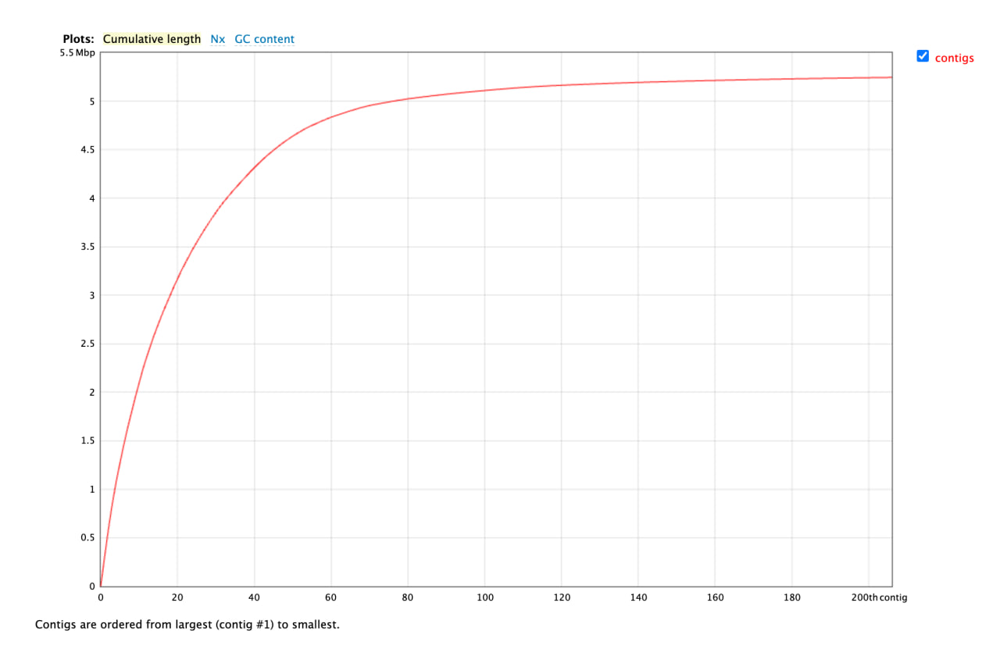
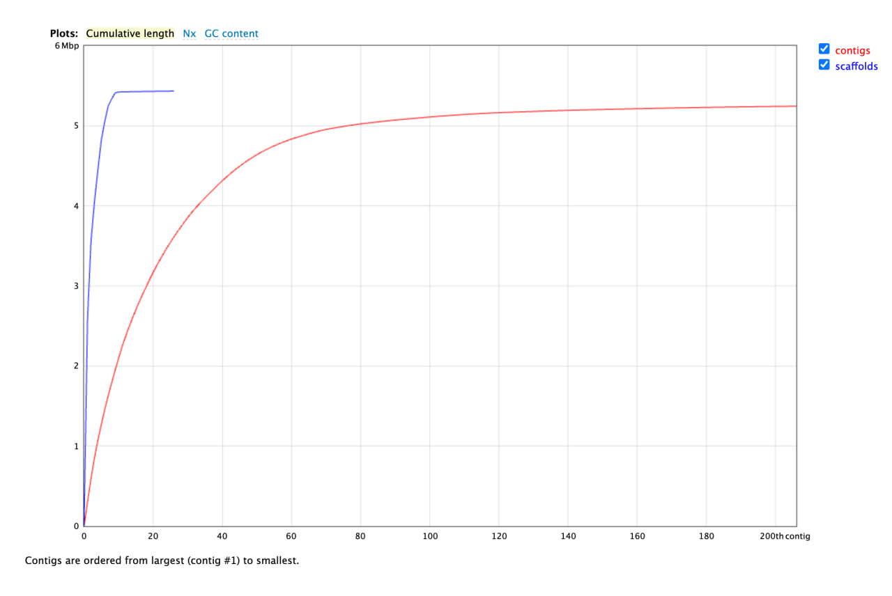

# E. coli-outbreak-assembly
  
De novo genome assembly and quality assessment

## Project overview
This project reproduces a basic bioinformatics workflow used during the investigation of the 2011 *Escherichia coli* outbreak.  
The goal is to assemble the genome of the outbreak strain from Illumina sequencing data, assess assembly quality, and prepare the ground for further comparative and hybrid (Illumina + long reads) analyses.

---

## Tools and software

The following tools were used in this project:

- **FastQC (v0.12.1)**  
  Quality control of raw Illumina sequencing reads.

- **Jellyfish**  
  K-mer counting and k-mer frequency analysis (k = 31) for genome size and coverage estimation.

- **SPAdes**  
  De novo genome assembly using Illumina paired-end reads.

- **QUAST (v5.3.0)**  
  Assembly quality assessment and calculation of standard assembly metrics (N50, contig count, total length, GC content).
---

 ## Data description

Illumina paired-end sequencing library:

- **SRA accession:** SRR292678  
- **Read type:** paired-end  
- **Read length:** 90 bp  
- **Insert size:** ~470 bp  
- **Files:** R1 and R2 (`.fastq.gz`)

Raw data are stored in `data/raw/illumina/`.

---

### Quality control of Illumina reads (FastQC)

FastQC was run on both paired-end files:

```bash
fastqc data/raw/illumina/*.fastq.gz \
  --outdir data/qc/fastqc \
  --threads 4
```

### FastQC summary (R1 and R2)

Total reads: 5,499,346

Read length: 90 bp

Total bases: ~494.9 Mb per file

GC content: 49%

Poor-quality reads: 0

**Conclusion: Read quality is high, with no adapter contamination or overrepresented sequences. No trimming was required prior to assembly.**

---

## K-mer analysis and genome size estimation

A k-mer frequency analysis (k = 31) was performed using Jellyfish to estimate genome size and coverage.

### K-mer counting

On macOS, reads were streamed via decompression:

```bash
gzip -dc data/raw/illumina/*.fastq.gz \
| jellyfish count \
    -m 31 \
    -C \
    -s 1G \
    -t 4 \
    -o data/kmer/SRR292678_k31.jf \
    /dev/stdin
```

### Histogram generation:

```bash
jellyfish histo \
  data/kmer/SRR292678_k31.jf \
  > data/kmer/SRR292678_k31.histo
```

**The k-mer histogram shows:**

- a large peak at depth = 1 (sequencing errors)

- a single dominant genomic peak at ~120–126

### Genome size estimation

Using:

- read length L = 90 bp

- k-mer size K = 31

- total bases T ≈ 990 Mb

- k-mer peak M ≈ 124

Estimated:

- Coverage: ~186×

- Genome size: ~5.3 Mb

This is consistent with the expected size of an E. coli genome.

---

## Illumina-only de novo assembly (SPAdes)

Genome assembly was performed using SPAdes with paired-end Illumina reads only:

```bash
spades.py \
  -1 data/raw/illumina/SRR292678sub_S1_L001_R1_001.fastq.gz \
  -2 data/raw/illumina/SRR292678sub_S1_L001_R2_001.fastq.gz \
  -o results/spades_illumina \
  -t 4 \
  -m 8 \
  2>&1 | tee logs/spades_illumina.log
```

Key output files:
```
contigs.fasta
scaffolds.fasta
```
Total assembly size is ~5.2 Mb, consistent with expectations.

### Assembly quality assessment (QUAST)

Assembly quality was evaluated using QUAST (without reference):

```bash
quast.py \
  results/spades_illumina/contigs.fasta \
  -o results/quast_illumina \
  --threads 4
```
**QUAST results (contigs ≥ 500 bp)**

- Total length: 5,244,705 bp

- Number of contigs: 206

- Largest contig: 300,784 bp

- N50: 105,346 bp

- GC content: 50.54%

- N’s: 0



**Conclusion:
The Illumina-only assembly has the expected genome size and GC content for E. coli. Fragmentation is typical for short-read-only assemblies and is expected to improve with the inclusion of long reads.**

---

## Impact of long reads (hybrid assembly)

To evaluate how long reads affect assembly quality, a precomputed hybrid assembly (Illumina + PacBio) was used. The PacBio library (SRR1980037) contains long reads with an average length of ~20 kb, which are able to span repetitive regions that cannot be resolved using short Illumina reads alone.

The following files were used:
```
results/spades_hybrid/scaffolds.fasta
```


### Assembly quality assessment (QUAST)

The Illumina-only and hybrid assemblies were compared using QUAST:

```bash
quast.py \
  results/spades_illumina/contigs.fasta \
  results/spades_hybrid/scaffolds.fasta \
  -o results/quast_compare \
  --threads 4
```

| Metric | Illumina-only assembly | Hybrid assembly |
|-------|------------------------|-----------------|
| Number of contigs / scaffolds (≥500 bp) | 206 | 26 |
| Total length (bp) | 5,244,705 | 5,433,714 |
| Largest contig / scaffold (bp) | 300,784 | 2,579,755 |
| N50 (bp) | 105,346 | 968,098 |
| GC content (%) | 50.54 | 50.60 |
| Number of N’s | 0 | 1,404 |




**Conclusion:** 
The hybrid assembly shows a substantial improvement in contiguity compared to the Illumina-only assembly. The number of fragments is strongly reduced and the N50 value increases by almost an order of magnitude. This improvement is explained by the ability of long PacBio reads to span repetitive genomic regions that cannot be resolved by short Illumina reads. The presence of N’s in the hybrid assembly is expected, as scaffolds may contain gap placeholders between joined contigs.

---

## Genome Annotation

After genome assembly, structural and functional annotation was performed to identify genes and other genomic features. Annotation was carried out using **Prokka**, which predicts coding sequences and RNA genes and assigns putative functions based on similarity to known bacterial proteins from the RefSeq database.

Due to computational constraints, **precomputed Prokka results** for the hybrid assembly were used.

The following annotated files were obtained:
```
results/prokka_hybrid/scaffolds.gbk
```

### Annotation summary

The main annotation statistics (from Prokka output) are:

- Number of contigs: **71**
- Genome size: **5,444,102 bp**
- Coding sequences (CDS): **5,145**
- rRNA genes: **24**
- tRNA genes: **96**
- tmRNA genes: **1**
- Repeat regions: **1**

These values are consistent with typical *Escherichia coli* genomes in terms of gene content and genome size.

### Output files

The key output file used for downstream analysis is:

- **`scaffolds.gbk`** — GenBank-formatted file containing the annotated hybrid assembly, compatible with comparative genomics tools such as Mauve.

**Conclusion:**  
Genome annotation identified the expected number of protein-coding genes and RNA features for an *E. coli* genome. The annotated GenBank file provides the basis for subsequent comparative genomic analysis and identification of strain-specific features.


---

## Finding the closest relative of *E. coli* X (16S rRNA, Mauve)

To identify the closest known relative of the assembled *E. coli* X genome, a comparative analysis based on **16S rRNA** was performed.

### Identification of the closest reference genome

The 16S rRNA gene was extracted from the hybrid assembly and used as a query for **NCBI Nucleotide BLAST** with the following parameters:

- Database: **Reference Genome Database (refseq_genomes)**
- Organism: *Escherichia coli*
- Entrez Query (date restriction): **`1900/01/01:2011/01/01[PDAT]`**

- Other parameters: default

The top BLAST hit showed **100% identity and full query coverage**, identifying the closest relative as:

- **Organism:** *Escherichia coli* strain 55989  
- **GenBank accession:** **NC_011748.1**

The complete reference genome was downloaded in FASTA format and used for further analysis.

### Whole-genome comparison with Mauve

Whole-genome alignment between *E. coli* X and *E. coli* 55989 was performed using **progressiveMauve**, comparing:

- Hybrid assembly of *E. coli* X (`scaffolds.gbk`)
- Reference genome *E. coli* 55989 (`55989.fasta`)


The alignment revealed:
- High overall synteny between the two genomes
- Multiple genomic rearrangements and inversions
- Several **large genomic regions present in *E. coli* X but absent in the reference strain**

These unique regions are consistent with horizontally acquired elements, such as prophages or pathogenicity islands.

**Conclusion:**  
*Escherichia coli* strain 55989 is the closest known relative of *E. coli* X based on 16S rRNA sequence comparison. Despite the overall genomic similarity, *E. coli* X contains large strain-specific genomic insertions, which are likely responsible for its pathogenic properties and will be investigated further.

---

## Genetic cause of HUS (Shiga toxin acquisition)

Clinical observations from the 2011 outbreak (bloody diarrhea and HUS) suggest that *E. coli* X carries an additional virulence factor compared to its closest known relative. The closest reference genome identified in this project was *Escherichia coli* strain 55989 (EAEC; accession **NC_011748.1**), which is associated with persistent diarrhea but not typically with hemorrhagic symptoms. This motivated a genome-wide comparison to identify strain-specific insertions in *E. coli* X that could explain the HUS phenotype.

### Rationale

- **Mauve** provides a whole-genome, synteny-based view and is well suited to locate **strain-specific insertions/deletions** and genomic rearrangements.
- However, **precise gene identification** (gene names, lengths, coordinates) is more robust when taken from **annotation output** (Prokka), rather than relying on GUI-based feature search.
- Additionally, during the attempt to align **GenBank vs GenBank** (to enable annotation-aware search inside Mauve), the `progressiveMauve` backend repeatedly terminated with **exit code 137**, which indicates the process was killed by the OS (most likely due to memory limits). Therefore:
  - Mauve was used to *visualize genome-wide differences* between *E. coli* X and the reference.
  - Prokka annotation files were used to *extract exact shiga toxin gene calls and coordinates*.

### Genome-wide comparison (Mauve)

A whole-genome alignment of *E. coli* X and *E. coli* 55989 was performed earlier using `progressiveMauve`. The alignment showed:

- High overall synteny between genomes
- Multiple rearrangements/inversions (expected among closely related *E. coli* strains)
- Several **large regions present in *E. coli* X but absent in the reference**, consistent with horizontally acquired elements (e.g., prophages or pathogenicity islands)

These strain-specific regions are prime candidates to contain additional virulence genes explaining HUS.

### Searching for shiga toxin genes in the annotated genome

To test the hypothesis that *E. coli* X acquired Shiga toxin genes, we searched the Prokka annotation of the hybrid assembly for shiga toxin-related entries.

Prokka output used:
- `results/prokka_hybrid/prokka_hybrid_SRR1980037/PROKKA_12062025.tsv`
- `results/prokka_hybrid/prokka_hybrid_SRR1980037/PROKKA_12062025.gbk`

#### 1) Detect shiga toxin genes (name/product)

```bash
grep -iE "stx|shiga" \
  results/prokka_hybrid/prokka_hybrid_SRR1980037/PROKKA_12062025.tsv \
  | head -n 50
```
Result:

- `stxA — Shiga toxin subunit A (length 960 bp)`

- `stxB — Shiga toxin subunit B (length 270 bp)`

#### 2) Extract genomic coordinates from GenBank annotation
```bash
grep -n -i -A6 -B20 'gene="stxA"' \
  results/prokka_hybrid/prokka_hybrid_SRR1980037/PROKKA_12062025.gbk \
  | head -n 60

grep -n -i -A6 -B20 'gene="stxB"' \
  results/prokka_hybrid/prokka_hybrid_SRR1980037/PROKKA_12062025.gbk \
  | head -n 60
```

| Gene     | Product               | Length (bp) | Coordinates        | Locus tag      |
| -------- | --------------------- | ----------: | ------------------ | -------------- |
| **stxA** | Shiga toxin subunit A |         960 | **400037..400996** | DMAJDCCL_04304 |
| **stxB** | Shiga toxin subunit B |         270 | **401008..401277** | DMAJDCCL_04305 |

Notably, **stxA** and **stxB** are adjacent in the genome, consistent with the typical organization of Shiga toxin loci. The surrounding context in the annotation also includes tRNA genes nearby, which is a common integration hotspot for mobile genetic elements and supports the hypothesis of horizontal gene transfer (often phage-mediated) of this virulence module.

**Interpretation and conclusion**

Shiga toxin is a well-established virulence factor responsible for endothelial damage and systemic complications that can lead to hemorrhagic colitis and HUS. The closest reference strain (E. coli 55989) is an enteroaggregative E. coli (EAEC) and explains diarrheal disease via adherence factors, but does not typically cause the hemorrhagic phenotype observed during the outbreak. In contrast, E. coli X contains the Shiga toxin gene cluster (stxA/stxB), providing a clear genetic explanation for the increased virulence.

---

## Tracing the source of shiga toxin genes in *E. coli* X

After detecting the Shiga toxin gene cluster (*stxA/stxB*) in *E. coli* X, we investigated the genomic neighborhood of these genes to infer how they were acquired. Shiga toxin genes in *E. coli* are frequently associated with mobile genetic elements (most commonly bacteriophages), so we inspected the local gene context around the toxin locus.

### Inspecting the genomic context around stxA/stxB (Prokka GenBank)

Because Mauve feature search was not available reliably in our setup (annotation-aware alignment was unstable on a laptop), the immediate neighborhood of the toxin genes was examined directly in the Prokka-annotated GenBank file.

The following command was used to print the region around *stxA*:

```bash
grep -n -i -A40 -B40 'gene="stxA"' \
  results/prokka_hybrid/prokka_hybrid_SRR1980037/PROKKA_12062025.gbk
```

### Findings

Analysis of the genomic region surrounding the shiga toxin locus revealed the following features:

- Two adjacent shiga toxin genes:
  - **stxA**: `CDS 400037..400996` (960 bp), locus tag `DMAJDCCL_04304`
  - **stxB**: `CDS 401008..401277` (270 bp), locus tag `DMAJDCCL_04305`

- Multiple **tRNA genes located immediately upstream** of the toxin genes:
  - `tRNA-Met` at `399695..399770`
  - `tRNA-Arg` at `399780..399856`
  - `tRNA-Arg` at `399870..399946`

- Several nearby CDS annotated as **hypothetical proteins** preceding the tRNA cluster  
  (e.g., locus tags `DMAJDCCL_04299`, `DMAJDCCL_04300`).

### Interpretation: likely phage-mediated acquisition

The combination of (1) an **adjacent stxA/stxB gene cluster**,  
(2) a surrounding region enriched in **hypothetical proteins**, and  
(3) close proximity to **tRNA genes** strongly suggests that the shiga toxin locus is part of a **horizontally acquired mobile genetic element**.

In bacterial genomes, **tRNA loci are common integration hotspots** for bacteriophages and other mobile elements. Shiga toxin genes are well known to be carried by **stx-converting bacteriophages**, which is fully consistent with the observed genomic context in *E. coli* X.


## Antibiotic resistance detection (ResFinder)

Antibiotic resistance genes were identified using `ResFinder` for *E. coli* X and the reference strain *E. coli* 55989.

| Antibiotic class | *E. coli* X | Reference (*E. coli* 55989) |
|------------------|------------|-----------------------------|
| β-lactams        | Resistant (blaCTX-M-15, blaTEM-1B) | Susceptible |
| Aminoglycosides  | Resistant (streptomycin) | Susceptible |
| Sulfonamides     | Resistant (sul1, sul2) | Susceptible |
| Trimethoprim     | Resistant (dfrA7) | Susceptible |
| Tetracyclines    | Resistant (tetA) | Resistant (tetB) |
| Fluoroquinolones | Susceptible | Susceptible |
| Carbapenems      | Susceptible | Susceptible |
| Colistin         | Susceptible | Susceptible |

### Interpretation

Compared to the reference strain, *E. coli* X exhibits a markedly expanded antibiotic resistance profile, including resistance to β-lactams (ESBL phenotype), aminoglycosides, sulfonamides, trimethoprim and tetracyclines.  

The reference strain *E. coli* 55989 shows resistance only to tetracyclines and remains susceptible to most clinically relevant antibiotics.

Although no fluoroquinolone resistance genes were detected in *E. coli* X, fluoroquinolones such as ciprofloxacin are known to induce the bacterial SOS response and activate shiga toxin–encoding bacteriophages. This likely contributed to the clinical complexity of antibiotic treatment during the outbreak.


---

## Antibiotic resistance mechanism (β-lactams)

ResFinder indicated that *E. coli* X is resistant to β-lactam antibiotics. A common mechanism of β-lactam resistance is enzymatic inactivation of the drug by **β-lactamases** (often encoded by `bla` genes), which hydrolyze the β-lactam ring.

### Detecting β-lactamase genes in *E. coli* X

We searched the Prokka annotation for β-lactamase-related entries:

```bash
grep -iE "bla|beta-lactamase" \
  results/prokka_hybrid/prokka_hybrid_SRR1980037/PROKKA_12062025.tsv
```

Detected β-lactamase genes:

- `ampC` (Beta-lactamase), 1134 bp

- `bla_1` (Beta-lactamase TEM), 861 bp

- `bla_2` (Beta-lactamase TEM), 861 bp

- `bla_3` (Beta-lactamase CTX-M-1), 876 bp

### Genomic context of bla genes (evidence for HGT)

To infer how these genes were acquired, we inspected the neighborhood around bla loci in the GenBank annotation:
```bash
grep -n -i -A40 -B40 'gene="bla' \
  results/prokka_hybrid/prokka_hybrid_SRR1980037/PROKKA_12062025.gbk
```

**Key observations:**

- The **bla_1 (TEM)** locus is surrounded by mobile element–related genes, including:
  - **IS26 transposase** (`IS6 family transposase IS26`)
  - **Tn3 resolvase** (`tnpR`)
  - a nearby **RepA** protein (`repA`), consistent with a **plasmid-associated region**

- The region containing **bla_2** and **bla_3 (CTX-M-1)** includes multiple transposition-related proteins:
  - **Tn3/Tn2 family transposases**
  - **ISEcp1 transposase**, a well-known element associated with mobilization of **CTX-M β-lactamase genes**

### Conclusion

β-lactam resistance in *E. coli* X is explained by the presence of multiple acquired β-lactamase genes (TEM and CTX-M family). The surrounding **transposases and resolvases** (IS26, Tn3/Tn2, ISEcp1) provide strong evidence that these resistance determinants were acquired via **horizontal gene transfer**, most likely as part of a **plasmid-associated mobile resistance cassette**.


## Conclusion

In this project, we performed a comprehensive genomic investigation of *Escherichia coli* X, the strain responsible for the 2011 outbreak, using a combination of de novo assembly, genome annotation, comparative genomics, and resistance profiling. Starting from raw sequencing data, we reconstructed the genome, assessed assembly quality, and identified key genetic features underlying the strain’s pathogenicity and clinical relevance.

Comparative analysis revealed that *E. coli* X is closely related to the enteroaggregative strain *E. coli* 55989, yet differs by the presence of additional virulence and resistance determinants. In particular, we identified the **Shiga toxin genes (stxA and stxB)**, which are absent in the reference strain and explain the severe clinical manifestations observed during the outbreak, including hemorrhagic colitis and hemolytic uremic syndrome (HUS). Analysis of the genomic context demonstrated that these genes were acquired via **horizontal gene transfer**, most likely through a bacteriophage-mediated insertion.

In addition to increased virulence, *E. coli* X exhibits **multidrug resistance**, including resistance to β-lactam antibiotics mediated by multiple acquired **β-lactamase genes** (TEM and CTX-M family). The surrounding transposases, resolvases, and insertion sequences indicate that these resistance genes were also introduced via **mobile genetic elements**, most likely plasmid-associated resistance cassettes. This combination of enhanced virulence and antibiotic resistance significantly complicated therapeutic decisions during the outbreak, particularly given that some antibiotics can induce prophage activation and increase toxin production.

Overall, this case study illustrates how bacterial pathogens can rapidly evolve through horizontal gene transfer, acquiring both virulence factors and antibiotic resistance under strong selective pressure. Although antibiotics have been used for less than a century, bacteria have already developed sophisticated mechanisms to evade them, leading to the emergence of multidrug-resistant and highly virulent strains. As highlighted by public health authorities, the effectiveness of antibiotics is diminishing, and controlling future outbreaks will require not only the development of new antimicrobial agents, but also **continued advances in bioinformatics and genomic surveillance** to detect, characterize, and contain emerging pathogens before they reach epidemic scale.
